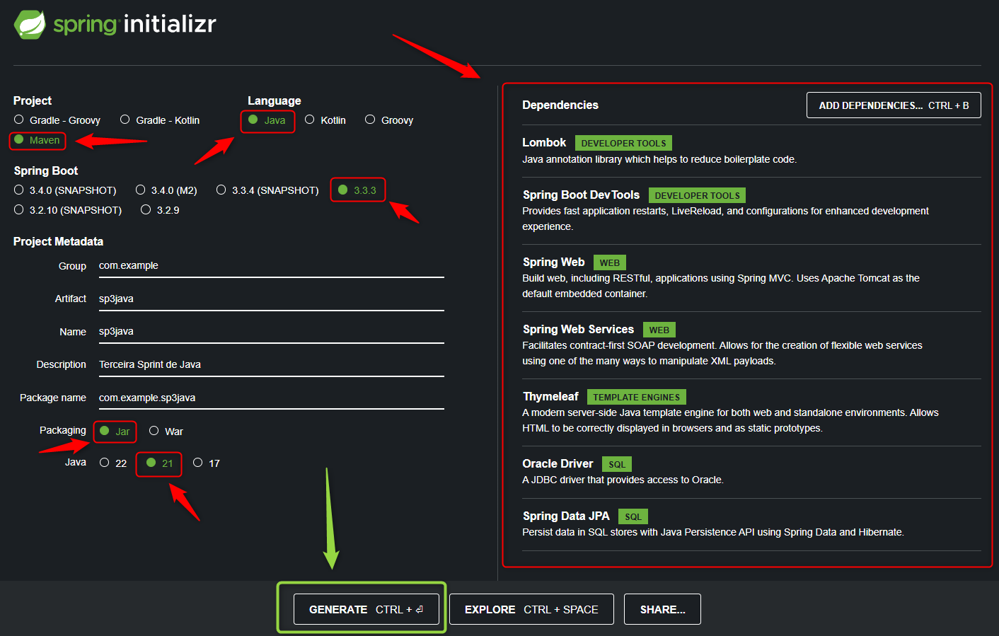
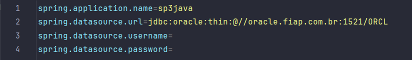
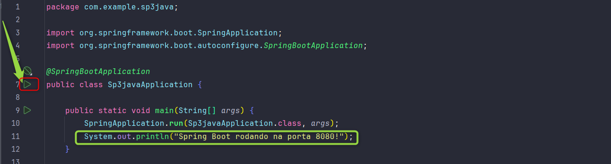
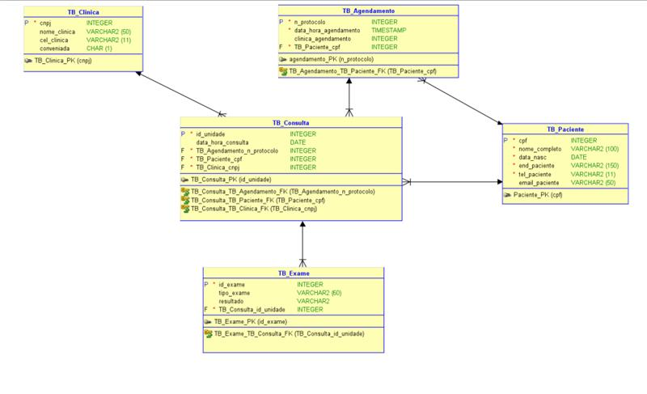
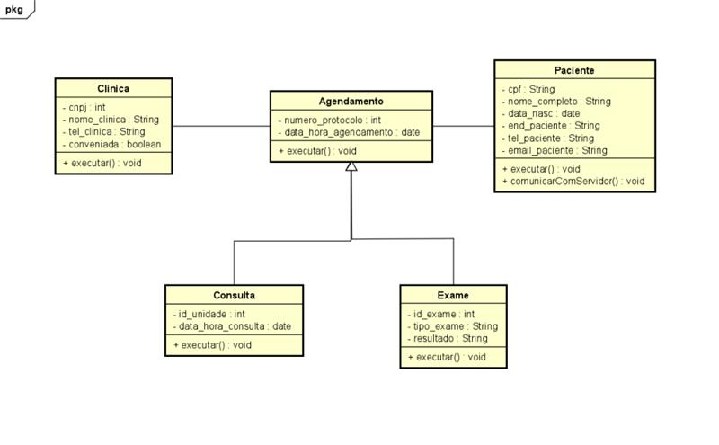

# Easy Tech
Proposta de sistema online para agendamento médico, promovendo acesso facilitado à saúde e aplicando os princípios da Sociedade 5.0 para melhorar a qualidade de vida dos pacientes.
## Integrantes

- MATHEUS MATOS - RM:99792
- KAREN VITORIA JESUS DA SILVA - RM:99468
- JULIANNY ARAUJO PEREIRA - RM:99554
- DIEGO HENRIQUE SANTOS DE OLIVEIRA - RM:550269
- JULIA DE FATIMA QUEIROZ - RM:551130

## Instruções para uso

### Configuração do Spring
- site: https://start.spring.io/
  

- application.properties
  

### Execução
O usuario deve rodar o Sp3JavaApplication dentro do projeto java.

### Utilização
O usuario pode cadastrar os seguintes dados no sistema utilizando o metodo POST:
- Paciente
- Exame
- Consulta

O usuario pode deletar os seguintes dados no sistema utilizando o metodo DELETE:
- Um exame
- Uma consulta

O usuario pode visualizar os seguintes dados no sistema utilizando o metodo GET:
- Lista de todos os exames
- Lista de todas as consultas

O usuario pode atualizar os seguintes dados no sistema utilizando o metodo PUT:
- Data de hora da consulta
- Data de hora do exame

O usuario tambem pode realizar o login no sistema com os seguintes dados utilizando o metodo POST:
- cpf
- senha

## Endpoints
#### localhost:8080

PACIENTES
- `/pacientes` - Tela com a lista de pacientes cadastrados no sistema.
- `/pacientes/cadastrar` - Cadastra um novo paciente no sistema.
- `/pacientes/login` - Tela de login do paciente
- `/pacientes/deletar` - Deleta um paciente específico.
- `/pacientes/homeUser` - Tela de usuario.

EXAMES
- `/exames` - Tela com a lista de exames cadastrados no sistema.
- `/exames/atualizar` - Atualiza a data e hora de um exame específico.
- `/exames/deletar` - Deleta um exame específico.
- `/exames/marcar` - Cadastra um novo exame no sistema.

CONSULTAS
- `/consultas` - Tela com a lista de consultas cadastradas no sistema.
- `/consultas/atualizar` - Atualiza a data e hora de uma consulta específica.
- `/consultas/deletar` - Deleta uma consulta específica.
- `/consultas/marcar` - Cadastra uma nova consulta no sistema.

## Imagens

- _**Entidades e Atributos**_ 
   

- **Paciente**
- cpf (chave primária)
- nome_completo
- data_nasc
- end_paciente
- tel_paciente
- email_paciente 
   

- **Consulta**
- id_consulta (chave primária)
- data_hora_consulta
- especialidade 
   

- **Exames**
- idExame (chave primária)
- data_hora_exame
- tipo 
   

## Nome da Aplicação
Easy Tech

## Nome completo e breve apresentação dos integrantes do Grupo
- Diego Henrique Santos de Oliveira:
  Atividade: ADVANCED BUSINESS DEVELOPMENT WITH .NET
  Responsabilidades:
  •	Desenvolver a Proposta de Solução, detalhando como a solução do projeto gera valor para o público-alvo e os benefícios oferecidos.
  •	Realizar a Análise da Concorrência, mapeando os principais concorrentes diretos e indiretos para entender o cenário competitivo.
  •	Especificar os Modelos de Receita, detalhando como o projeto gerará receita e apresentando as diversas fontes de renda previstas.

- Júlia de Fatima Queiroz:
  Atividade: MASTERING RELATIONAL AND NON-RELATIONAL DATABASE
  Responsabilidades:
  •	Desenvolver os Diagramas no Oracle Data Modeler, cumprindo a notação DER (Logical Model) e MER (Physical Model), utilizando a notação de Barker para o DER (Logical Model) e garantindo que esteja na 3ª Forma Normal (3FN).
  •	Gerar o Modelo Físico e criar os objetos/esquema no banco de dados.
  •	Preencher no mínimo 5 registros para cada tabela, de acordo com a especificação do projeto.
  •	Criar dois blocos anônimos para mostrar os dados inseridos, com pelo menos 3 consultas de junções (Joins) utilizando agrupamento (group by) e ordenação (order by).
  •	Preparar o entregável, que consiste em um arquivo zipado contendo o PDF do Projeto de Banco de Dados Relacional e um arquivo .sql com os scripts separados por tabela, além do PDF do modelo lógico e físico.

- Julianny Araujo Pereira:
  Atividade: MOBILE APP DEVELOPMENT
  Responsabilidades:
  •	Desenvolvimento do Protótipo Não Funcional de uma Solução Mobile
  •	Criar um wireframe de uma solução mobile com no mínimo 5 telas.
  •	Acompanhar cada tela com explicações detalhadas, incluindo descrições dos elementos e funcionalidades presentes em cada tela.
  •	Incluir cenários possíveis de sucesso e erro, detalhando como a solução se comportará em diferentes situações.
  •	Preparar o entregável, que consiste em um documento do Word com imagens e explicações, contendo o nome completo e RM de todos os integrantes do grupo na capa.

- Karen Vitória Jesus da Silva:
  Atividade: DEVOPS TOOLS E CLOUD COMPUTING
  Responsabilidades:
  •	Justificar a Contribuição da Técnica de Virtualização para o Projeto
  •	Justificar como a técnica de Virtualização pode contribuir na entrega do projeto identificado pelo grupo.
  •	Organizar e estruturar o material gerado de forma coerente e organizada.
  •	Demonstrar os conhecimentos adquiridos em aula e apresentar um texto aderente à solução proposta pelo grupo.
  •	Incluir exemplos e aderência para a solução apresentada pelo grupo.
  •	Adicionar imagens explicativas para ilustrar e melhorar o entendimento da dissertação e da solução apresentada.
  •	Preparar o entregável em formato PDF.

- Matheus Matos Pereira:
  Atividade: DISRUPTIVE ARCHITECTURES: IOT, IOB &
  GENERATIVE IA
  Responsabilidades:
  •	Criar um vídeo pitch com duração máxima de 3 minutos, apresentando a ideia do projeto de forma macro.
  •	Apresentar o tema escolhido pelo grupo.
  •	Explicar o problema identificado.
  •	Apresentar as alternativas de solução consideradas.
  •	Descrever os frameworks/bibliotecas Python que serão utilizados, sendo específico quanto aos motivos de escolha.
  •	Descrever de que forma os conceitos de Machine Learning / IA serão aplicados no desenvolvimento do projeto, sendo específico neste requisito.

- Todos os membros:
  Atividade: COMPLIANCE & QUALITY ASSURANCE
  •	Desenvolvimento da Declaração de Visão e Escopo do Projeto em Formato PITCH:
  •	Todos os membros devem colaborar para desenvolver a declaração de visão e escopo do projeto em formato PITCH, contendo:
  •	Descrição do problema a resolver
  •	Descrição dos objetivos da solução idealizada
  •	Definição do público-alvo que comprará/usará a solução
  •	Estudo de produtos semelhantes já existentes no mercado
  •	Avaliação do potencial de mercado

- Todos os membros:
  Atividade: JAVA ADVANCED

•	Desenvolvimento da Solução Java com Spring Boot:
•	Apresentar o cronograma de desenvolvimento e respeitar os prazos.
•	Apresentar imagens explicativas da arquitetura, definição das classes de domínio da aplicação e o respectivo Diagrama de Classes de Entidade.
•	Implementar as classes de Entidade necessárias para solução do problema, com atenção ao correto encapsulamento, à tipagem dos atributos e ao Mapeamento Objeto Relacional com JPA e Hibernate.
•	Garantir que a aplicação respeite os conceitos fundamentais do REST (RESTful) e que a API esteja de acordo com o modelo de maturidade nível 1.
•	Demonstrar a Gestão de Configuração dos Artefatos de Software, disponibilizando todos os artefatos produzidos no Github.
•	Enviar o link para o projeto público compartilhado no github contendo toda a documentação, código-fonte, arquivo README.md com informações pertinentes, diagramas, vídeo apresentando a Proposta Tecnológica, e a listagem de todos os endpoints (Documentação da API).
•	Demonstrar preocupação em testar a aplicação e provar com documentos, disponibilizando arquivos para que os professores possam realizar testes dos endpoints e garantir a perfeita persistência e recuperação dos dados.

## Link Pitch
https://www.youtube.com/watch?v=EkemseY8PlA

